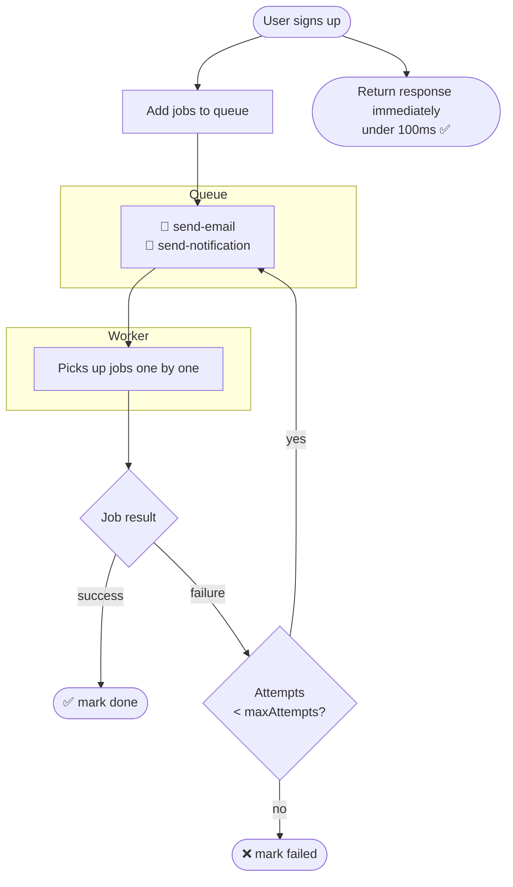
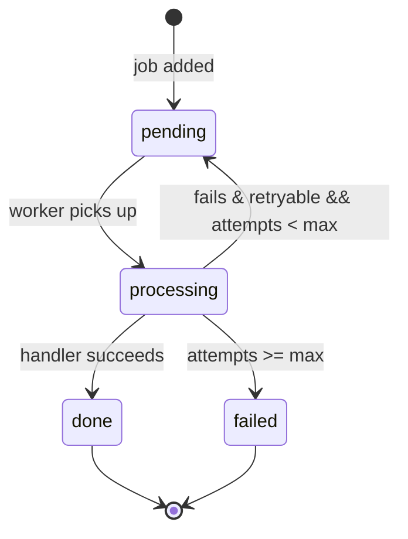

# Job Queue

A FIFO job queue engine implemented in TypeScript using Node.js EventEmitter. Supports async job handlers, configurable retry logic, full lifecycle events, and real-time stats. It was built to understand the internals behind tools like BullMQ and RabbitMQ without relying on any external dependencies.

---

## The Real World Problem

Imagine a user clicks **Sign Up** on your SaaS app. Your server needs to:

```
1. Save user to database        →  10ms
2. Send welcome email           → 800ms  ← slow
3. Resize profile picture       → 600ms  ← slow
4. Notify analytics service     → 400ms  ← slow
─────────────────────────────────────────
Total wait time for user:        1810ms  ← terrible UX
```

The user is sitting there waiting nearly **2 seconds** just to see a success screen.

The fix? Return the response immediately and process the heavy work in the background. That's exactly what a Job Queue does.

---

## Why Naive Solutions Don't Work

**Just run them in parallel?**

```typescript
await Promise.all([sendEmail(), resizeImage(), notifyAnalytics()]);
```

Better, but the user still waits for the slowest operation. And if one fails, everything fails.

**Fire and forget?**

```typescript
sendEmail(); // no await
resizeImage(); // no await
return response;
```

Returns fast, but now you have no idea if tasks succeeded or failed. No retry logic. No visibility. Dangerous in production.

**The real insight:** responding to the user and processing heavy work are two separate concerns. They should never be coupled together.

---

## How It Works



---

## Implementation

Built using two core ideas:

**FIFO Queue:** jobs are processed in the order they arrive. First in, first out.

**EventEmitter:** notifies listeners at every stage of a job's lifecycle so you always know what's happening.

### Job Lifecycle



### File Structure

```
job-queue/
├── queue.ts      # JobQueue class
├── types.ts      # Job and JobHandler types
├── test.ts       # real-world usage scenarios
└── README.md
```

---

## Usage

### 1. Create a queue

```typescript
import { JobQueue } from './queue';

const queue = new JobQueue(3); // 3 = max total attempts
```

### 2. Register job handlers

```typescript
queue.register('send-email', async (data) => {
    await sendEmail(data?.to as string);
});

queue.register('resize-image', async (data) => {
    await resizeImage(data?.filename as string);
});
```

### 3. Add jobs

```typescript
// Returns immediately as processing happens in the background
queue.add('send-email', { to: 'alice@example.com' });
queue.add('resize-image', { filename: 'avatar.png' });
```

### 4. Listen to events

```typescript
queue.on('job:added', (job) => console.log(`Added: ${job.name}`));
queue.on('job:processing', (job) => console.log(`Processing: ${job.name}`));
queue.on('job:done', (job) => console.log(`Done: ${job.name}`));
queue.on('job:retry', (job, attempt) => console.log(`Retry #${attempt}`));
queue.on('job:failed', (job, err) => console.log(`Failed: ${err.message}`));
```

### 5. Check stats

```typescript
const stats = queue.stats();
// {
//   done: 2,
//   failed: 1,
//   total: 3,
//   queue: [],        ← pending jobs
//   finishedJobs: [...]   ← completed jobs
// }
```

---

## Events Reference

| Event            | When it fires                | Payload              |
| ---------------- | ---------------------------- | -------------------- |
| `job:added`      | Job enters the queue         | `job`                |
| `job:processing` | Worker picks up the job      | `job`                |
| `job:done`       | Job completed successfully   | `job`                |
| `job:retry`      | Job failed and will retry    | `job, attemptNumber` |
| `job:failed`     | Job failed after all retries | `job, error`         |

---

## Retry Logic

When a job throws an error, the queue retries it automatically until
`maxAttempts` total attempts are exhausted, then marks it as failed.

```typescript
const queue = new JobQueue(3); // 3 total attempts (1 initial + 2 retries)

queue.register('always-failing', async () => {
    // Always throws, triggering up to 2 retries before marking the job as failed
    throw new Error('Temporary failure');
});

// Output:
// ⚙️  Processing: always-failing
// 🔄 Retrying: always-failing (attempt 1)
// 🔄 Retrying: always-failing (attempt 2)
// ❌ Job failed: always-failing
```

---

## Running the Tests

```bash
# Install dependencies
npm install

# Run real-world scenarios
npm run test
```

### Test scenarios covered

| Scenario              | What it tests                                        |
| --------------------- | ---------------------------------------------------- |
| User signs up         | 3 jobs processed in order                            |
| Always failing job    | Retries 2 times (3 total attempts) then marks failed |
| Flaky job             | Fails twice, succeeds on 3rd attempt                 |
| Heavy load            | 5 jobs queued and processed sequentially             |
| No handler registered | Fails gracefully with descriptive error              |

---

## Complexity

| Operation     | Time | Space |
| ------------- | ---- | ----- |
| Add job       | O(1) | —     |
| Process job   | O(1) | —     |
| Stats         | O(n) | —     |
| Queue storage | —    | O(n)  |

---

## Real World Connection

This pattern powers every serious backend system:

- **BullMQ:** the most popular Node.js job queue, uses Redis as the backing store
- **Sidekiq:** same pattern in Ruby
- **Celery:** same pattern in Python
- **AWS SQS:** managed cloud version of this exact idea

The difference between this implementation and BullMQ is persistence (Redis survives server restarts) and concurrency (multiple workers). The core concept (decouple task creation from task execution) is identical.

---

## What I Learned

Before building this I thought job queues were just "run stuff later." Now I understand the real challenge is **reliability**. It's about guaranteeing that every task eventually completes, even across failures, retries, and restarts. That's what makes a job queue genuinely useful in production, and why tools like BullMQ and RabbitMQ exist.

I also learned about **Event Loop Starvation and Call Stack safety** in Node.js:

- **The Problem:** If you recursively call an asynchronous function like `process()` immediately when a job fails or has no handler, it doesn't yield control back to Node.js. With a large volume of synchronous events or errors, this triggers an immediate `Maximum call stack size exceeded` error.
- **The Solution (`setImmediate`):** By wrapping the recursive loop inside `setImmediate(() => this.process())`, we push the next job evaluation to the _Check phase_ of the Node.js event loop. This clears the call stack, lets the CPU breathe, allows garbage collection to run, and prevents the engine from crashing under heavy, rapid loads.

---
